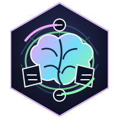
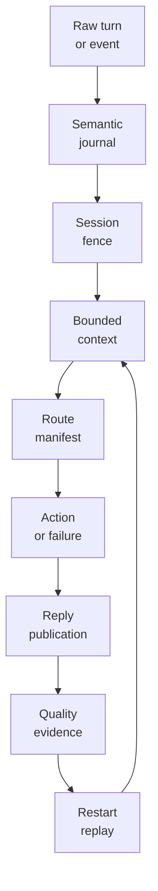
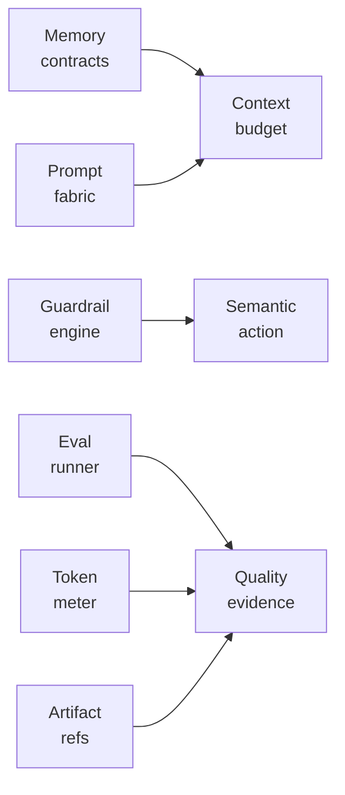
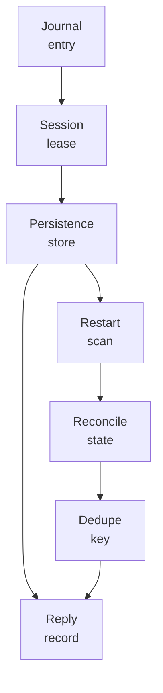
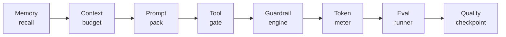

<p align="center">
  
</p>

<p align="center">
  <a href="https://github.com/nshkrdotcom/outer_brain">
    
  </a>
  <a href="https://github.com/nshkrdotcom/outer_brain/blob/main/LICENSE">
    
  </a>
</p>

# OuterBrain

OuterBrain is the provider-neutral semantic-runtime gateway above Citadel.

It owns durable semantic-session truth, tool-manifest snapshots, prompt and
strategy shaping, semantic quality checkpoints, live session fencing,
provider-neutral semantic failure carriers, and restart-safe reply publication.
It does not own provider memory, RAG engines, or model-specific cognition as
platform truth.

## Scope

- raw input normalization
- durable semantic state and journaling
- context assembly
- prompt and strategy shaping
- provider-neutral semantic failure normalization
- normalized semantic activity contracts with bounded routing facts
- semantic context provenance, duplicate suppression, and redaction evidence
- structured action-request synthesis
- provisional and final reply publication
- restart-safe downstream follow-up

## Status

Active workspace buildout. The repo uses a non-umbrella workspace layout with
core packages, a dedicated raw-Ecto persistence layer, bridges, a host surface,
and proving examples.

## Stack Position And Runtime Shape

OuterBrain is the semantic layer above deterministic authority and below host
or product presentation. It should be the place where ambiguous language-facing
work becomes structured semantic facts, while Citadel remains the policy
kernel, Jido Integration remains the lower execution owner, and Mezzanine owns
durable operational truth once a product workflow is admitted.

The runtime loop is intentionally explicit:

1. capture a raw turn or inbound event in the semantic journal
2. acquire the semantic-session fence for the current epoch
3. build a bounded context pack from memory, prompt fabric, and caller input
4. validate the selected route/tool/action against a stored manifest snapshot
5. compile a provider-neutral action request or semantic failure carrier
6. publish provisional or final user-facing state with idempotent keys
7. record provenance, redaction, duplicate-suppression, and quality evidence
8. recover from durable journal/publication evidence after restart

That shape keeps semantic facts replayable without requiring lower workflow
history to contain raw prompts, raw context packs, provider-native payloads, or
private reasoning.

## Current Package Families

The workspace currently contains these active families:

- `outer_brain_contracts`, `outer_brain_core`, `outer_brain_journal`,
  `outer_brain_persistence`, `outer_brain_runtime`,
  `outer_brain_restart_authority`, and `outer_brain_quality` for the core
  semantic runtime.
- `outer_brain_prompting`, `prompt_fabric`, `context_budget`,
  `memory_contracts`, `memory_engine`, `guardrail_contracts`,
  `guardrail_engine`, `eval_runner`, and `token_meter` for prompt/context,
  memory, guardrail, eval, and cost-sensitive semantic support.
- `outer_brain_authority_evidence`, `ai_artifact_contracts`, and
  `optimization_artifact_store` for ref-only evidence and adaptive artifact
  lineage.
- bridge packages for Citadel, typed domain routes, publication, review, and
  GroundPlane-shaped projections.
- `apps/host_surface` and examples for console chat and direct Citadel action
  proof.

## Current Proof And Acceptance Posture

OuterBrain has durable semantic-session and restart-safety proof coverage in
StackLab. The important current claim is not "complete agent intelligence";
the claim is that semantic runtime state can be captured, bounded, recovered,
and published without leaking raw prompt/provider material or pretending that
trace/projection data is policy authority.

Recent work added memory/context packages, prompt fabric and guardrails, token
metering, eval-runner support, adaptive artifact identity, optimization
artifact graph history, semantic persistence posture, authority evidence
projection, and cleanup of env/regex/atom hazards.

## Ownership Rules

OuterBrain may normalize semantic failures such as stale context, route
ambiguity, adapter unavailability, provider refusal, semantic loops, and budget
exhaustion. It should not make governance decisions, mutate provider state
directly, select connector credentials, or decide product-specific review
workflow. Those effects cross into Citadel, Jido Integration, Mezzanine, or
AppKit-owned surfaces.

## Runtime Diagrams





## Developer Flow Diagrams





Adaptive layer additions:

- `core/ai_artifact_contracts`: ref-only artifact identity for prompt, role,
  skill, GEPA, eval, replay, router, provider, endpoint, promotion, and
  rollback refs.
- `core/optimization_artifact_store`: ref-only artifact graph history for
  candidate lineage, eval evidence, promotion, and rollback decisions.

Phase 7 persistence posture is carried through semantic sessions, prompt/
context provenance, journals, duplicate suppression, publication state,
authority evidence, and projection/publication bridges. The default profile is
memory/ref-only; durable refs are explicit, redacted evidence, and debug
sidecar failure cannot mutate semantic-session, prompt provenance,
suppression, publication, projection, or failure-journal state.

## Development

The project targets Elixir `~> 1.19` and Erlang/OTP `28`. The pinned toolchain
lives in `.tool-versions`.

```bash
mix deps.get
mix ci
```

The welded `outer_brain_contracts` artifact is tracked through the prepared
bundle flow:

```bash
mix release.prepare
mix release.track
mix release.archive
```

`mix release.track` updates the orphan-backed
`projection/outer_brain_contracts` branch so downstream repos can pin a real
generated-source ref before any formal release boundary exists.

## Documentation

- `docs/overview.md`
- `docs/layout.md`
- `docs/runtime_model.md`
- `docs/integration_surface.md`
- `CHANGELOG.md`

This project is licensed under the MIT License.
(c) 2026 nshkrdotcom. See `LICENSE`.

## Temporal developer environment

Temporal runtime development is managed from `/home/home/p/g/n/mezzanine`
through the repo-owned `just` workflow. Do not start ad hoc Temporal processes
or rely on the `temporal` CLI as the implementation runbook.

## Native Temporal development substrate

Temporal runtime development is managed from `/home/home/p/g/n/mezzanine` through the repo-owned `just` workflow, not by manually starting ad hoc Temporal processes.

Use:

```bash
cd /home/home/p/g/n/mezzanine
just dev-up
just dev-status
just dev-logs
just temporal-ui
```

Expected local contract: `127.0.0.1:7233`, UI `http://127.0.0.1:8233`, namespace `default`, native service `mezzanine-temporal-dev.service`, persistent state `~/.local/share/temporal/dev-server.db`.

## Persistence Documentation

See `docs/persistence.md` for tiers, defaults, adapters, unsupported selections, config examples, restart claims, durability claims, debug sidecar behavior, redaction guarantees, migration or preflight behavior, and no-bypass scope when applicable.
